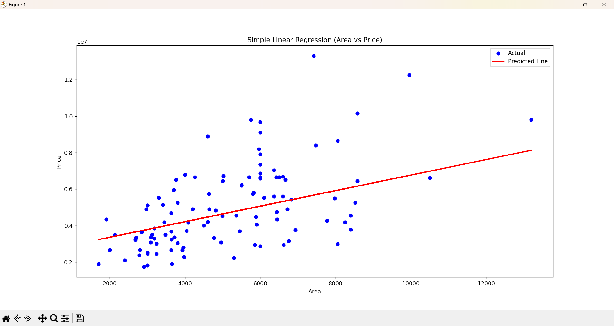
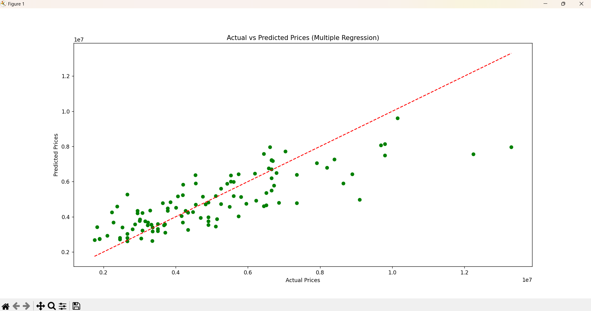

# House Price Prediction – Linear Regression

This project demonstrates **Simple Linear Regression** and **Multiple Linear Regression** using a house price dataset. The aim is to predict house prices based on factors such as **area**, **bedrooms**, **bathrooms**, etc.

---

## Steps Performed

### 1. **Importing Libraries**

* Imported essential Python libraries:

  * `pandas` for data handling
  * `numpy` for numerical operations
  * `matplotlib` & `seaborn` for visualization
  * `sklearn` for regression models and evaluation metrics

### 2. **Loading the Dataset**

🔗 [Click here to view/download the dataset on Kaggle](https://www.kaggle.com/c/house-prices-advanced-regression-techniques/data)

* Loaded the dataset containing:

  * **Price** – target variable
  * **Area**, **Bedrooms**, **Bathrooms**, etc. – independent variables.

### 3. **Exploratory Data Analysis (EDA)**

* Checked data types, missing values, and dataset structure.
* Visualized the relationship between **area** and **price**.

### 4. **Simple Linear Regression**

* Used **Area** as the independent variable and **Price** as the dependent variable.
* Fitted the regression line and visualized it.
* **Interpretation Example**:
  If `area` increases by **1 sq ft**, price changes by approximately **235.97 units** (holding other variables constant).

📷 **Simple Linear Regression Output:**

---

### 5. **Multiple Linear Regression**

* Used **Area**, **Bedrooms**, and **Bathrooms** as independent variables.
* Obtained regression coefficients and intercept.
* Evaluated model performance using:

  * **Mean Squared Error (MSE)**
  * **R² Score**
* **Interpretation Example**:

  * Each coefficient shows the expected change in price for a one-unit change in that variable, keeping others constant.

📷 **Multiple Linear Regression Output:**

---

## **Model Evaluation Results**

* **MSE**: `1754318687330.66`
* **R²**: `0.6529` → The model explains about **65%** of the variation in prices.

---

Do you want me to now **also include the Python code in this README** so it becomes fully reproducible? That would make it more complete.
